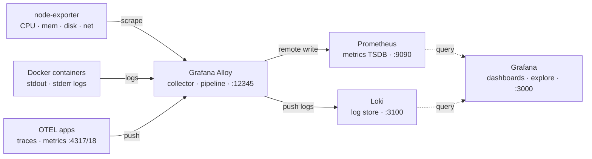

# Observability-Lab-LGAT
Local observability stack using Grafana Alloy, Prometheus, and Loki — metrics, logs, and traces collected via Docker with zero cloud dependency.


---

## Overview

This project demonstrates a production-inspired observability stack running entirely on Docker Compose. It covers the three pillars of observability — **metrics**, **logs**, and **traces** — using the Grafana ecosystem as the backbone.

Built as a hands-on portfolio project to showcase SRE skills in telemetry collection, pipeline configuration, and visualization.

## Architecture



## Stack Components

| Component | Role | Version |
|---|---|---|
| **Grafana Alloy** | Telemetry collector — scrapes metrics, collects Docker logs, receives OTEL signals | Latest |
| **Prometheus** | Metrics storage and query engine | Latest |
| **Loki** | Log aggregation and storage | Latest |
| **Grafana** | Unified visualization and dashboards | Latest |
| **Node Exporter** | Host-level system metrics (CPU, memory, disk, network) | Latest |

---

## Features

- **Automatic Docker log collection** — Alloy discovers all running containers via the Docker socket and ships logs to Loki without any per-container configuration
- **Host metrics scraping** — node-exporter exposes system-level metrics; Alloy scrapes and forwards to Prometheus via remote write
- **OTEL endpoint** — Alloy exposes ports `4317` (gRPC) and `4318` (HTTP) for OpenTelemetry traces and metrics ingestion
- **Single network** — all services communicate on an isolated Docker bridge network; no host networking required
- **No cloud dependency** — fully self-contained, runs on any machine with Docker installed

---

## Prerequisites

- Docker Desktop (or Docker Engine + Compose plugin)
- 4GB RAM recommended
- Ports `3000`, `3100`, `9090`, `12345`, `4317`, `4318` available on your host

---

## Getting Started

**Clone the repository:**

```bash
git clone https://github.com/<your-username>/observability-lab.git
cd observability-lab
```

**Start the stack:**

```bash
docker compose up -d
```

**Verify all services are running:**

```bash
docker compose ps
```

**Access Grafana:**

Open [http://localhost:3000](http://localhost:3000) in your browser.
Default credentials: `admin / admin`

---

## Exploring the Stack

### Logs (Loki)

Navigate to **Explore → Loki** and run:

```logql
{service_name="unknown_service"}
```

Or filter by container:

```logql
{container_name="prometheus"}
```

### Metrics (Prometheus)

Navigate to **Explore → Prometheus** and run:

```promql
# CPU usage
100 - (avg by (instance) (rate(node_cpu_seconds_total{mode="idle"}[5m])) * 100)

# Memory usage
node_memory_MemAvailable_bytes / node_memory_MemTotal_bytes * 100

# Disk usage
node_filesystem_avail_bytes{mountpoint="/"}
```

### Alloy UI

Open [http://localhost:12345](http://localhost:12345) to inspect the Alloy pipeline graph — see all components, their health status, and data flow in real time.

---

## Project Structure

```
OBSERVABILITY-STACK/
├── docker-compose.yml          # Service definitions and network config
├── alloy/
│   └── config.alloy            # Alloy pipeline configuration
├── prometheus/
│   └── prometheus.yml          # Prometheus scrape config (if applicable)
└── README.md
```

---

## Configuration Notes

### Alloy Pipeline (`alloy/config.alloy`)

- `discovery.docker` — auto-discovers all running containers via Docker socket
- `loki.source.docker` — tails container logs and forwards to Loki
- `prometheus.scrape` — scrapes node-exporter on port `9100`
- `prometheus.remote_write` — pushes metrics to Prometheus via remote write API
- OTEL receiver configured on `0.0.0.0:4317` (gRPC) and `0.0.0.0:4318` (HTTP)

### Known Behaviour

- On first start, Loki's ingester takes ~15-30 seconds to become ready. Alloy retries automatically — no manual intervention needed.
- The `remotecfg` warning in Alloy logs (`noop client`) is expected in local mode and does not affect functionality.

---

## Roadmap

- [ ] Add Grafana dashboards as code (provisioning via `dashboards/` folder)
- [ ] Add Tempo for distributed tracing
- [ ] Kubernetes (EKS) deployment using Helm charts
- [ ] Terraform module for EKS cluster provisioning
- [ ] Alerting rules for Prometheus + Grafana alert routing

---

## Skills Demonstrated

`Grafana Alloy` `Prometheus` `Loki` `Docker Compose` `OpenTelemetry` `Log pipeline design` `Metrics collection` `Container observability` `SRE tooling`

---

## Author

**Ramakrishnan S** — Senior Site Reliability Engineer  
[LinkedIn](https://linkedin.com/in/<your-linkedin>) · [GitHub](https://github.com/<your-username>)
